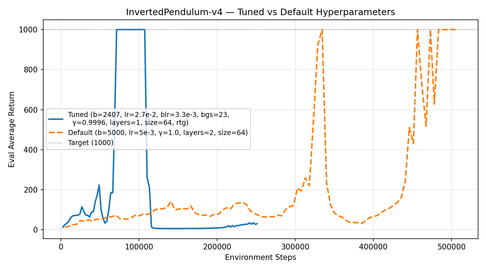

## 3.2 Questions
– Which value estimator has better performance without advantage normalization: the trajectorycentric one, or the one using reward-to-go?
The reward to go looks slightly better, althought there looks like almost no difference in the small batch size experiment.

– Between the two value estimators, why do you think one is generally preferred over the other?
The reward to go seems to have less variance because it uses causality to remove the rewards before a decision. It also seems a tiny bit more elegant to implement programatically.

– Did advantage normalization help?
It seems to help quite a bit. the average reward gets to 200 quicker, and once there deviates less compared to non normalized runs.

– Did the batch size make an impact?
Yes, the smaller batch sizes seem to converge faster than the large experiments, but at the cost of having more instability after convergence.

command line configuration:
```bash
./experiment1.sh
```

## 4.2 questions

I changed the bgs to 2 from 5 for the experiment. 
a) The baseline learning curve is much more unstable (some spikes and a big uptrend towards the end) wiht only 2 steps. 
b) The eval avg return also decreased a lot at the beginning (around 1000) most likely due to the high baseline loss. The avg eval return went down when the baseline learning curve went up at the end suggesting the baseline got worse and made the policy worse as a result.

command line configuration:
```bash
./experiment2.sh
```


# 5 questions

What does λ = 0 correspond to?
It corresponds to a temporal difference of 1 (having very low vairance with high bias)
What about λ = 1? Relate this to the task
performance in LunarLander-v2 in one or two sentences.
It correspods to a monte carlo rollouts were variance is big but bias is low.
• Provide the exact command line configurations you used to run your experiments, including any parameters changed from defaults.
command line configuration:
```bash
./experiment3.sh
```

# 6 questions
See `deliverables/logs/pendulum_best.csv`. The best run reaches eval average return of 1000 by iteration 28 (~71K env steps).

best hyperparams
```bash
uv run src/scripts/run.py \
    --env_name InvertedPendulum-v4 \
    -n 100 \
    -b 2407 \
    -eb 1000 \
    --learning_rate 2.7e-02 \
    --baseline_learning_rate 3.3e-03 \
    --baseline_gradient_steps 23 \
    --discount 0.9996 \
    --n_layers 1 \
    --layer_size 64 \
    --use_reward_to_go \
    --exp_name pendulum_best \
    --group pendulum_sweep
```

### Hyperparameter discussion
I ran a random search (20 trials) sampling learning rates and batch size in log-space, then refined with a second round of 20 trials centered on the best configuration. 

Key observations:

Learning rate was the most impactful parameter. The default of 5e-3 was too conservative; values around 2-3e-2 converged much faster. This makes sense since InvertedPendulum is a relatively simple task where aggressive updates don't destabilize training.

Discount factor close to but slightly below 1.0 (γ=0.9996) not sure if this is just coincidencedue to random sampling or not.
Reward-to-go (`-rtg`) helped — the best runs consistently had it enabled, consistent with the CartPole findings.

Network architecture mattered less than expected. A single hidden layer of 64 units outperformed deeper/wider networks, suggesting the value function for this task is relatively simple.


Baseline gradient steps (bgs=23) — more steps for the baseline helped stabilize advantage estimation, but the baseline learning rate needed to be lower (3.3e-3 vs default 5e-3).

Batch size around 2400 struck a good balance — large enough for stable gradients but small enough for fast iterations.



The tuned hyperparameters reach max reward of 1000 at around 71K steps, while the default takes ~328K steps.
